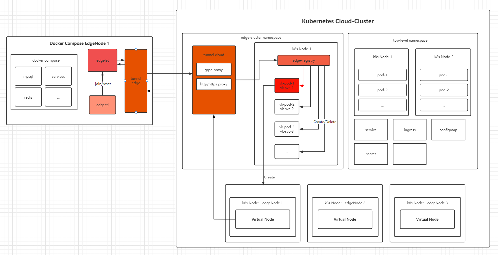

# Edge 

## edgelet
与k8s-cloud集群和命令行工具edgectl进行交互的grpc服务，通常被部署在边缘盒子上,主要功能有：
+ 为edgectl提供join/reset
+ 与云端的edge-registry交互，实现边缘节点注册到云端k8s集群
+ 与云端的virtual-kubelet Pod交互，实现边缘盒子内的服务部署与更新


## edgectl
* 与edgelet交互的命令行工具，主要命令有:
    + join: 边缘盒子注册到云端k8s集群
    + reset： 边缘盒子注销在云端k8s集群


## edge-registry
部署在云端的服务，负责接收边缘盒子中edgelet发起的注册/注销请求，通过创建virtual-kubelet Pod -> 创建K8s Node -> vk-pod 与边缘edgelet 实现双向通信 -> 提供Pod调度/Node状态更新的能力 来达到伪装K8s-Node的功能


## 拓扑图




## 快速上手

### 编译
+ 记得拉git submodule

```shell
git submodule init
git submodule update
```
+ 编译命令

```shell
make 
```

### 生成镜像

```shell
make image
```